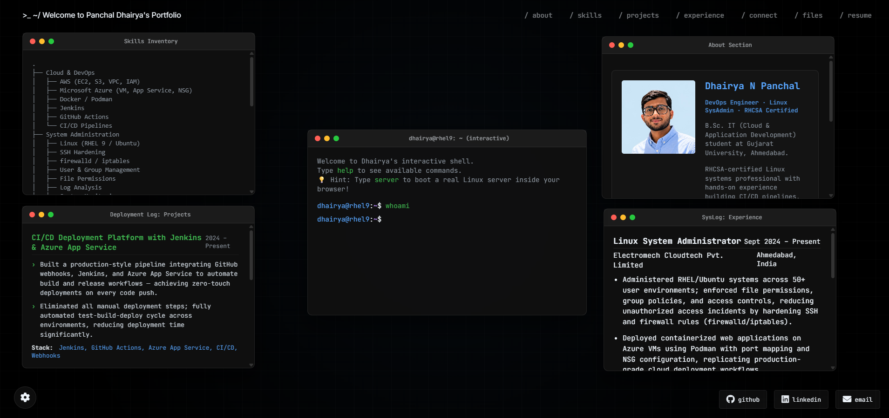

<div align="center">

```
 ____  _          _ _  _____     _ _       
/ ___|| |__   ___| | ||  ___|__ | (_) ___  
\___ \| '_ \ / _ \ | || |_ / _ \| | |/ _ \ 
 ___) | | | |  __/ | ||  _| (_) | | | (_) |
|____/|_| |_|\___|_|_||_|  \___/|_|_|\___/ 
```

[](https://YOUR_VERCEL_LINK_HERE)

### `dhairya@portfolio:~$ whoami`

**DevOps Engineer · Linux SysAdmin · RHCSA Certified**

*B.Sc. IT (Cloud & Application Development) · Gujarat University, Ahmedabad*

<br/>

[](https://github.com/panchaldhairya16/whoami-dhairya/raw/main/DhairyaPanchal-CV.pdf)
&nbsp;
[](https://linkedin.com/in/dhairyapanchal)
&nbsp;
[](https://github.com/panchaldhairya16)

<br/>



</div>

---

## `$ cat /etc/os-release`

> A fully interactive, browser-based **Linux Desktop Environment** built as a personal portfolio — no frameworks, no servers, pure vanilla web tech. Boot a real Alpine Linux terminal inside your browser, simulate Docker containers, switch between 5 terminal themes, and explore my work like navigating a Unix workspace.

---

## `$ ls -la features/`

```
drwxr-xr-x  features/
├── 🖥️  interactive-terminal     # Full CLI with 15+ real commands
├── 🐳  docker-simulator         # Mock container engine (docker run -it centos)
├── 🐧  wasm-linux-vm            # Real Alpine Linux via WebAssembly (v86)
├── 🎨  theme-switcher           # 5 themes: Dracula · Matrix · GitHub · Tokyo Night · Midnight Black
├── 🪟  draggable-windows        # Desktop-style floating app containers
└── 📬  contact-form             # Formspree-powered direct inbox mailer
```

---

## `$ uname -a` — Tech Stack

<div align="center">

| Layer | Technology |
|---|---|
| **Core** | HTML5 · CSS3 · JavaScript ES6+ (100% Vanilla, Zero Frameworks) |
| **Virtualization** | WebAssembly · v86 x86 Emulator |
| **Icons & Fonts** | FontAwesome · JetBrains Mono · Inter |
| **Mailer** | Formspree API |
| **Hosting** | Vercel |

</div>

---

## `$ systemctl status themes`

<div align="center">

| Theme | Command | Colors |
|---|---|---|
| 🌑 Midnight Black *(default)* | `theme midnight` | `#000000` `#58a6ff` `#3fb950` |
| 🧛 Dracula Dark | `theme dracula` | `#0b0e14` `#58a6ff` `#bc8cff` |
| 💚 Matrix Green | `theme matrix` | `#020502` `#00ff00` `#39ff14` |
| 🐙 GitHub Dark | `theme github` | `#0d1117` `#58a6ff` `#8b949e` |
| 🌃 Tokyo Night | `theme tokyonight` | `#1a1b26` `#7aa2f7` `#bb9af7` |

</div>

---

## `$ git clone && run`

```bash
# 1. Clone the repo
git clone https://github.com/panchaldhairya16/whoami-dhairya.git
cd whoami-dhairya

# 2. Serve locally (CORS requires a local server)
python -m http.server 8000

# 3. Open in browser
xdg-open http://localhost:8000
```

> **Note:** Must be served via a local HTTP server — direct `file://` access is blocked by browser CORS policies.

---

## `$ vim config.js` — Customize It

All personal content lives in a single file: **`config.js`**

```js
const CONFIG = {
  pageTitle: "Your Name | Your Role",
  terminalUser: "yourname",
  terminalHost: "yourhostname",

  about: {
    name: "Your Full Name",
    pfp: "profile.png",           // ← drop your photo here
    titleRole: "Your Role",
    // ...bio, skills, projects, experience
  },

  connect: {
    formspreeId: "YOUR_FORMSPREE_ID",   // ← plug in your Formspree ID
  },

  resumeUrl: "YourResume.pdf"           // ← add your resume PDF
};
```

---

## `$ docker ps` — Terminal Commands

```
COMMAND         DESCRIPTION
────────────────────────────────────────────────
whoami          About me & bio
skills          ASCII tree of my tech stack
projects        Deployment log of key projects
experience      SysLog of work history
resume          Open / download my CV
connect         Open contact form
theme [name]    Switch terminal theme
docker          Simulate container environments
server          Boot real Alpine Linux (WASM)
ls / files      Browse filesystem
clear           Clear terminal output
help            List all available commands
```

---

## `$ cat /proc/about`

```
Name     :  Dhairya N Panchal
Role     :  DevOps Engineer · Linux SysAdmin
Location :  Ahmedabad, Gujarat, India (GMT +5:30)
Cert     :  RHCSA — Red Hat Certified System Administrator
Study    :  B.Sc. IT · Cloud & Application Development · Gujarat University
```

**Currently exploring:** AWS infrastructure optimization · Kubernetes · SRE practices

**Community:** AWS Community Ahmedabad · Elastic Ahmedabad — organizing meetups on cloud & observability

---

## `$ ls certifications/`

```
├── ✅ RHCSA — Red Hat Certified System Administrator
├── ✅ AWS Academy — Cloud Foundations
├── ✅ AWS Basics — KodeKloud
└── ✅ Cloud Computing — EC-Council
```

---

## `$ chmod 777 contribute`

Contributions are welcome! Check **[CONTRIBUTING.md](CONTRIBUTING.md)** for guidelines on reporting issues, suggesting features, and submitting pull requests.

```bash
# Fork → Clone → Branch → Commit → PR
git checkout -b feat/your-feature
git commit -m "feat: add your feature"
git push origin feat/your-feature
```

---

## `$ cat LICENSE`

Released under the [MIT License](LICENSE) — free to use, modify, and deploy for your own portfolio.

*If this helped you, drop a ⭐ — it helps other DevOps engineers find this project.*

---

<div align="center">

```
dhairya@portfolio:~$ exit
Connection to dhairya.dev closed.
```

**[⚡ Live Preview](https://YOUR_VERCEL_LINK_HERE)** · **[LinkedIn](https://linkedin.com/in/dhairyapanchal)** · **[GitHub](https://github.com/panchaldhairya16)** · **[Email](mailto:panchaldhairya2005@gmail.com)**

</div>
